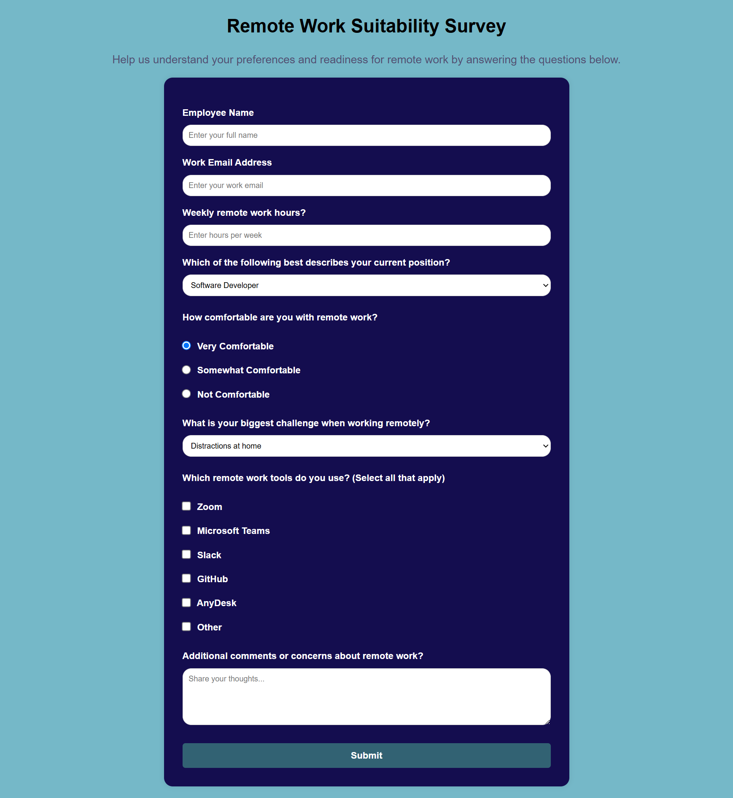

# Survey-Form


A clean, responsive **Survey Form** built using **HTML** and **CSS** as part of my web development learning journey. This form collects basic user feedback and demonstrates practical knowledge of layout design, form elements, and responsive styling.

---

## 🔗 Live Demo

👉 [Click here to view the live project](https://codewithokasha.github.io/Survey-Form/)

---

## 📸 Screenshot



---

## 📚 Project Description

This survey form project was created to apply fundamental concepts of HTML and CSS, including form handling, layout design, and visual styling. It's built with a focus on:

- ✅ Clean structure using semantic HTML5 tags  
- ✅ User-friendly and visually appealing layout  
- ✅ Responsive design that works across all devices  
- ✅ Well-organized form inputs with labels and placeholders  

This project serves as a strong foundation for building more interactive forms in real-world websites and web applications.

---

## 🛠️ Technologies Used

- HTML5
- CSS3

---

## ✨ Features

- 📱 Mobile-friendly responsive design
- 📥 Input fields with labels, dropdown, and radio buttons
- 🎨 Simple and clean UI
- 💡 Basic form validation using HTML attributes

---

## 📂 Folder Structure

```bash
/
│
├── index.html       # Main HTML file
├── style.css        # CSS styling
└── README.md        # This documentation file
